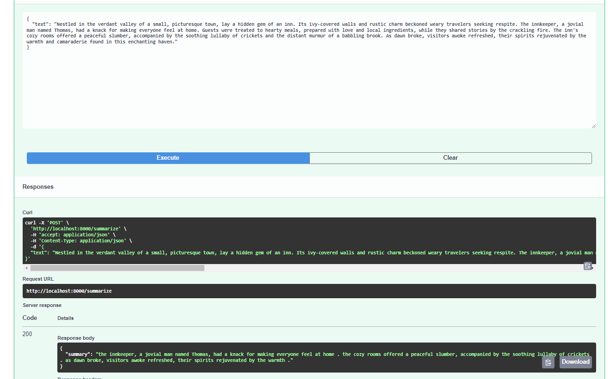

# Summarizer

## Overview
Summarizer is a backend project, `/summary` endpoint is main point to interact

## Key Features
- **Summarizer:** summarize your text
- **Flexible Configuration:** Configuration via `.env`
- **Scalability:** Designed with extensibility in mind, easy to scale

## Installation Requirements
Before starting, ensure your system meets the following requirements:
- Python 3.11 or newer
- Docker or system boot

### Installation Steps
1. **Repository Setup:** Clone the repository to your local system.
2. **Environment Configuration:** Copy the `.env.example` file to `.env` and configure it according to your needs.
3. **Dependency Installation:** `pip install -r requirements.txt`

## Run app

After all installations:
`uvicorn backend.app.main:app --reload`
then go to '/docs' or use Postman, Curl etc. to use /summary

## Example of summaring

